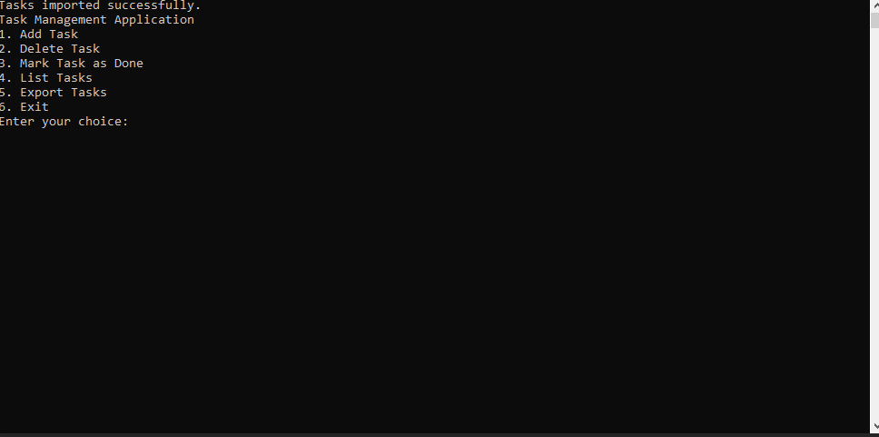

https://youtu.be/t0B748710Jw

Prerequisites:

Visual Studio 2017 (or a compatible version) installed on your system.
C++ development environment set up in Visual Studio.
Step-by-step instructions:

Open Visual Studio 2017.

Go to "File" > "Open" > "Project/Solution".

Navigate to the directory where you have saved the Task Manager project (e.g., "C:\Users\YourUsername\Documents\TaskManagerMain\TaskManagerMain").

Select the project file "TaskManagerMain.vcxproj" and click "Open".

The Task Manager project will be loaded in Visual Studio.

In the Solution Explorer window (usually on the right side of the screen), expand the project folder ("TaskManagerMain").

Right-click on the "Source Files" folder and select "Add" > "Existing Item".

Navigate to the location where you have the "TaskManager.cpp" and "TaskManager.h" files (e.g., "C:\Users\YourUsername\Documents\TaskManagerMain\TaskManagerMain").

Select both files and click "Add".

In the Solution Explorer window, right-click on the "UnitTest1" folder and select "Add" > "New Item".

Choose "C++ File (.cpp)" and name it "UnitTest1.cpp". Click "Add".

Replace the contents of "UnitTest1.cpp" with the unit test code provided earlier.

Save all the changes.

In the top menu, select "Build" > "Build Solution" or press "Ctrl + Shift + B" to build the solution. Ensure that the build is successful without any errors.

Once the build is complete, you can run the Task Manager application in one of the following ways:

a. Debug Mode:
- Press "F5" or go to "Debug" > "Start Debugging".
- The console window will open, and you can interact with the application through the displayed menu.
- Follow the menu options to add tasks, delete tasks, mark tasks as done, list tasks, export tasks, and exit the application.

b. Release Mode:
- Press "Ctrl + F5" or go to "Debug" > "Start Without Debugging".
- The console window will open, and you can interact with the application through the displayed menu.
- Follow the menu options to perform various operations on tasks.
- Note: In release mode, the application may close immediately after completing the tasks, so make sure to observe the console output before it closes.

Follow the on-screen instructions and enter the corresponding numbers or input data to perform various actions in the Task Manager application.

Test different features of the application, such as adding tasks, deleting tasks, marking tasks as done, listing tasks, exporting tasks, and exiting the application.

Make sure to check the console output for any error messages or relevant information.

That's it! You have compiled and run the Task Manager application using Visual Studio 2017. Enjoy organizing your tasks efficiently with the application.
